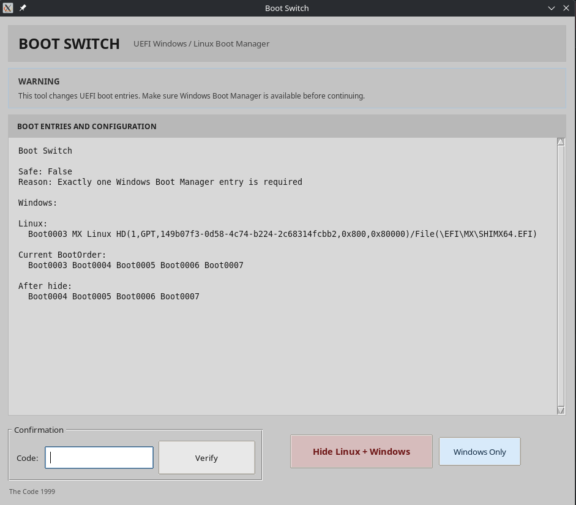

# boot switch

boot switch is a simple linux tool for switching between linux and windows through uefi.

it lets you make windows the default boot option and hide the linux boot entry without deleting your linux installation.

## features

- detect windows and linux boot entries
- view the current boot order
- make windows the default
- hide linux boot entries
- create a backup before changing boot entries
- restore the previous boot configuration
- check the system before making changes
- run tests without changing the real uefi configuration

## requirements

- linux
- python 3
- uefi
- efibootmgr
- pkexec

## install

clone the repository:

    git clone https://github.com/zenobiatranoss/boot-switch.git
    cd boot-switch

make the scripts executable:

    chmod +x run.sh install.sh

install the desktop launcher:

    ./install.sh

## run

    ./run.sh

the app will check your system first and show the available boot entries.

## test

the included tests use simulated boot entries, so they do not change your real uefi settings.

run:

    python3 tests.py

expected result:

    Ran 14 tests
    OK

## how it works

boot switch changes the uefi boot entries used by your computer.

when switching to windows, it puts windows boot manager first and can remove the linux boot entries from the uefi boot list.

your linux files and partitions are not deleted.

a backup is created before the linux boot entries are removed.

## important

this tool is intended for systems that already have both linux and windows installed.

if windows boot manager is not found, boot switch will not perform the windows switching operation.

## license

ISC
